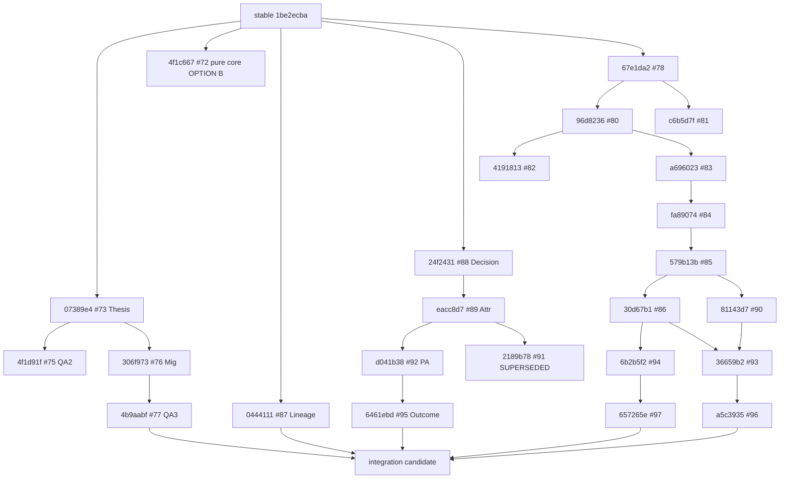

# Dependency DAG — Project Consolidation Candidate

All SHAs are full unless noted. Base stable:

```text
feature/research-system-v01
1be2ecba505a8108740c311c103a2c72d3bcd444
```

## Formal Thesis DAG

```text
stable@1be2ecba505a8108740c311c103a2c72d3bcd444
├─ #72 pure projection core
│    4f1c6674429d062490b6eaf3b4074f64214cf8b8
│    (runtime authority decision: OPTION B → not independent API)
└─ #73 Formal Thesis contract
     07389e4debf20bbfd61bf521d03a9aba65f7afa6
     ├─ #74 QA1 acceptance (history)
     │    e1e0b78c257bdfc2e83812db8ac8215cd97696cd
     ├─ #75 QA2 concurrency
     │    4f1d91f9553f66884b993a7d60dbff5313c9132a
     └─ #76 migration tooling
          306f9734592a4a3966c1d0dae2904be26de8c946
          └─ #77 QA3 migration acceptance
               4b9aabf6631d87bedbcc98ccd763c02933cd1ea2
```

## Decision / Trade / Outcome DAG

```text
stable@1be2ecba505a8108740c311c103a2c72d3bcd444
├─ #87 Campaign re-entry lineage
│    0444111a3934307edc8b5add8adba273833ba3b5
└─ #88 Frozen Decision Ledger
     24f243125bff9b641d8314e142c05e8df3202987
     └─ #89 Decision↔Trade Attribution
          eacc8d79c51c07ff400fabee0b0314dd57135b13
          ├─ #92 Performance Attribution provenance
          │    d041b38ca81e5ebb55731bc2380c77409f70736c
          │    └─ #95 Outcome reintegration (contains #92)
          │         6461ebd27adeacf141b72f7f4b4ee3c82947523e
          └─ #91 Outcome original (SUPERSEDED by #95)
               2189b78f16a90fdec3b3382931f1da58f2396596
```

Verified: `#95` contains `#92` (`d041b38...` is ancestor of `6461ebd...`).

## Fact Lake + Selection DAG (Q1 line)

```text
stable@1be2ecba...
└─ #78 Data Governance North Star
     67e1da2e7a839659c1d6f78d2741defe5cbd08a9
     └─ #80 DS-A1 Canonical Contract
          96d8236c2cb249e7b2b763bd68890da8d1ed6efd
          ├─ #82 ashare-lake gap (docs)
          │    41918133171c19cbb729a4930e73572e70fe0493
          └─ #83 S1A Raw Observation
               a69602331df2fb3147af3d4cfe5416f5d34a877a
               └─ #84 S1B limit-up shadow
                    fa89074e1b055f9a819513c2d2b770458e83ff97
                    └─ #85 S1C replay / multiprocess
                         579b13bf1e158c2445b81ac095a303ec7e55622d
                         └─ #86 S2 financial indicator
                              30d67b17e2ee2db62e0cc6ea3f6b20e83070d62d
                              └─ #94 S3 tushare daily
                                   6b2b5f206e35eeff49eb85b97cb7f197723f85a8
                                   └─ #97 Q1 publication selection
                                        657265e1eb442e86d88656c6db96bfdb6a6aff6f
```

Sibling docs:

```text
#78
└─ #81 DS-R1 inventory
     c6b5d7ff416e88289e58ad6aa7133cbf6623c75f
```

## Health DAG (H line)

```text
#85 S1C 579b13bf1e158c2445b81ac095a303ec7e55622d
└─ #90 H1 health core
     81143d7641b472af03cdbd89c78cfb239b4dd7d2

#86 S2 30d67b17e2ee2db62e0cc6ea3f6b20e83070d62d
+ #90 H1 (merged into H2 branch)
└─ #93 H2 health adapter
     36659b2e8af9088652c4f566f5599486c3f463a1
     └─ #96 H3 legacy projection
          a5c3935d6417bd44476a42975beb8dc5a2c296f8
```

## Q1 + H3 Convergence (synthetic)

Verified pre-integration:

```text
merge-base(Q1, H3) = S2@30d67b17e2ee2db62e0cc6ea3f6b20e83070d62d
Q1 ancestor-of H3? NO
H3 ancestor-of Q1? NO
```

Q1-only commits after S2:

```text
68091ff feat(fact-lake): third dataset canonicalization poc v0.1
6b2b5f2 fix(fact-lake): revision authority and daily identity closure
7555c2a feat(fact-lake): canonical publication selection semantics core v0.1
657265e fix(fact-lake): strict selection output authority closure
```

H3-only commits after S2:

```text
8ea32b0..81143d7 H1
e5914f6 merge H1 into H2 base
f20de1d..36659b2 H2
f49c77a..a5c3935 H3
```

Synthetic integration strategy executed:

```text
stable
 → merge Q1@657265e1eb442e86d88656c6db96bfdb6a6aff6f
 → merge H3@a5c3935d6417bd44476a42975beb8dc5a2c296f8
```

Result: single exact head contains S3+Q1+H1+H2+H3 with no nontrivial file conflicts.

## Mermaid (high level)


